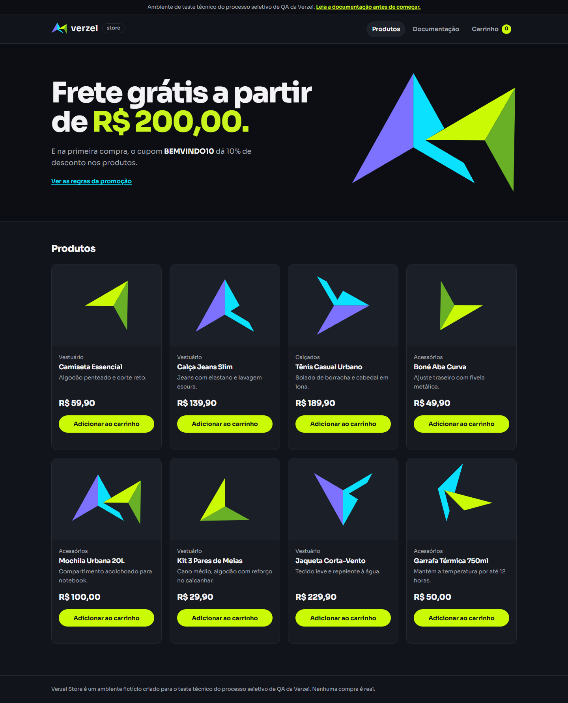
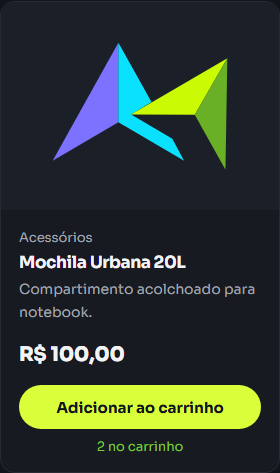
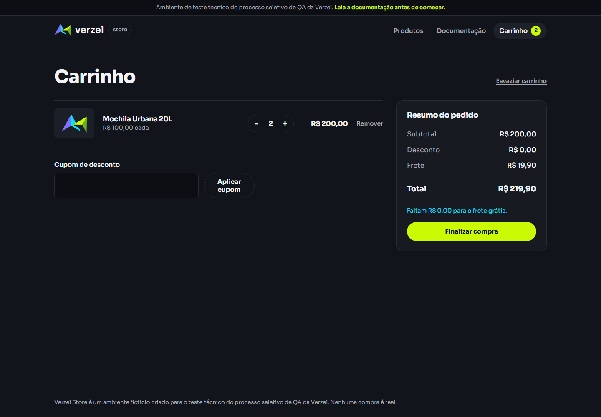
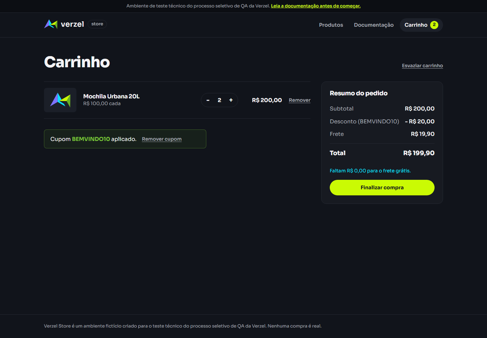

# Bugs encontrados

## BUG-001: Frete nao fica gratis a partir de R$ 200,00

- Criterios: CA06 e CA08.
- Severidade sugerida: alta; o total do pedido fica acima do valor esperado.
- Passos pela interface:
	1. Abrir a página inicial da loja.
	2. Adicionar duas Mochilas Urbanas 20L ao carrinho (subtotal de R$ 200,00).
	3. Abrir o carrinho e conferir o resumo.
	4. Aplicar `BEMVINDO10` e conferir novamente o resumo.
- Esperado: frete R$ 0,00, pois o subtotal original e igual ao limite.
- Observado: API e interface retornam frete R$ 19,90. Com cupom, o desconto de R$ 20,00 e calculado, mas o frete continua R$ 19,90.
- Evidencias visuais passo a passo, geradas por `npm run evidence:bug-001`:
	- `docs/evidencias/bug-001/01-catalogo.png`
	- `docs/evidencias/bug-001/02-produto-adicionado-duas-vezes.png`
	- `docs/evidencias/bug-001/03-carrinho-subtotal-200-frete-cobrado.png`
	- `docs/evidencias/bug-001/04-carrinho-apos-cupom.png`
- Video curto com a reproducao completa: [bug-001-frete-no-limite.webm](evidencias/bug-001/bug-001-frete-no-limite.webm), gerado com `npm run video:bug-001`.
- Evidencias automatizadas: casos Playwright CA06 e CA08, com traces e screenshots em `test-results/`.

### Evidencias visuais passo a passo

1. Catálogo da loja antes de adicionar o produto:

	

2. Duas Mochilas Urbanas 20L adicionadas:

	

3. Carrinho com subtotal de R$ 200,00 e frete cobrado incorretamente:

	

4. Mesmo carrinho após aplicar o cupom; o frete continua em R$ 19,90:

	

## BUG-002: API aceita mais de cinco unidades do mesmo produto

- Criterio: CA10.
- Severidade sugerida: alta; permite um pedido fora do limite definido.
- Passos: enviar `POST /api/carrinho/calcular` com `P001`, quantidade 6.
- Esperado: HTTP 422 e `erro.codigo` igual a `QUANTIDADE_MAXIMA_EXCEDIDA`.
- Observado: HTTP 200.
- Escopo: interface bloqueia o incremento apos cinco unidades; a validacao do limite nao e consistente na API.
- Evidencia: caso Playwright CA10 de API, com trace e contexto em `test-results/`.
